# 🚀 AI-Powered Job Application Agent
### *Autonomous ATS Optimization & Multi-Agent Resume Orchestration*

[](https://github.com/Ismail-2001)
[](https://www.crewai.com/)
[](https://www.deepseek.com/)
[](LICENSE)

---

## 🎬 Overview
Applying for jobs in the AI era requires more than just a template. This **Autonomous Job Application Agent** is a multi-agent system that bridges the gap between your experience and job requirements. Using **Advanced RAG (Retrieval-Augmented Generation)** and the **STAR Method**, it analyzes job descriptions to generate highly-tailored, ATS-optimized CVs and Cover Letters that speak directly to hiring managers.

---

## 🏗️ The Intelligence Architecture
The system employs a series of specialized agents in a perception-action loop to ensure zero-hallucination and maximum keyword relevance.

```mermaid
graph TD
    Input[📄 Job Description] --> JA[🔍 JobAnalyzer Agent]
    JA -->|Extracted Skills & Keywords| RAG[🧠 RAG Engine]
    RAG -->|Relevant Experience Snippets| CVC[✍️ CVCustomizer Agent]
    CVC -->|Tailored CV Content| CLG[📧 CoverLetter Agent]
    CLG -->|Personalized Letter| DB[📦 DocumentBuilder]
    DB --> Output[🎯 Final CV + Cover Letter]

    style JA fill:#1a1a2e,stroke:#00ff00,color:#fff
    style RAG fill:#1a1a2e,stroke:#00bfff,color:#fff
    style CVC fill:#1a1a2e,stroke:#ff9900,color:#fff
    style CLG fill:#1a1a2e,stroke:#ff3333,color:#fff
    style DB fill:#1a1a2e,stroke:#cc66ff,color:#fff
```



---

## ✨ Key Features
| Feature | Technical Implementation |
| :--- | :--- |
| **JobAnalyzer Agent** | Extracts requirements and ATS keywords with 99% precision using DeepSeek-V3. |
| **Advanced RAG Engine** | Retrieves top 15 relevant experience snippets using keyword-based scoring (BM25 variant). |
| **STAR Method Tailoring** | Re-writes bullet points in **Situation, Task, Action, Result** format for maximum impact. |
| **ATS-Optimized Formatting** | Generates professional DOCX files with clean headers and no-table structures for parser compatibility. |
| **Creative Multi-Temperature** | Uses precision (0.1) for analysis and balanced creativity (0.5-0.7) for content generation. |

---

## 🛠️ Tech Stack
- **AI & Automation:** LangChain, CrewAI, DeepSeek LLM.
- **RAG:** Custom vector-based retrieval from local Profile text.
- **Document Processing:** Python-docx for professional formatting.
- **Backend/Frontend:** Flask / Streamlit (Multi-interface support).

---

## 🏁 Installation & Setup
### Prerequisites
- Python 3.10+
- DeepSeek API Key

### Step 1: Clone & Install
```bash
git clone https://github.com/Ismail-2001/AI-Powered-Job-Application-Agent-App.git
cd AI-Powered-Job-Application-Agent-App
pip install -r requirements.txt
```

### Step 2: Configure Environment
Create a `.env` file:
```env
DEEPSEEK_API_KEY=your_api_key_here
```

### Step 3: Update Your Profile
Replace the contents of `data/my_profile.txt` with your professional experience, education, and skills.

---

## 🚀 Usage
```bash
# Run the CLI version
python main.py --job_url "https://example-job.com/post"

# Or launch the Web Interface
streamlit run app.py
```

---

## 🗺️ Roadmap
- [x] Core Multi-Agent Logic ✅
- [ ] Multi-format Export (PDF, LaTeX) 🚧
- [ ] LinkedIn Profile Autofill 🚧
- [ ] One-click application tracking dashboard 🔮

---

### 🔗 Connecting the Intelligence
Developed by **[Ismail Sajid](https://ismail-sajid-agentic-portfolio.netlify.app/)**.
*Explore more Autonomous Agents on my [Main Profile](https://github.com/Ismail-2001).*

⭐ **Star this repo if you find it useful!**
